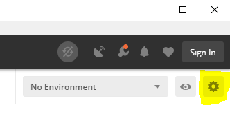
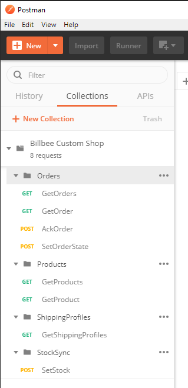
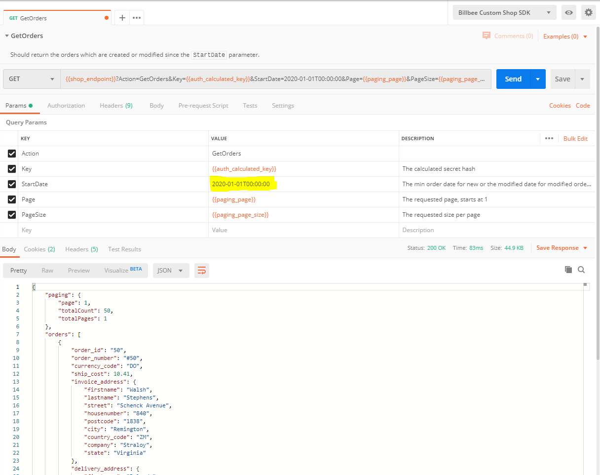

# Billbee Custom Shop API Postman Collection

This repository contains a Postman collection to test your implementation of the custom shop API.

## How to use

### Download and import the Postman collection
1. Download the [Postman cllection](./billbee_custom_shop.postman_collection.json)
2. Open Postman and click `File > Import...` or press `ctrl + o`
3. Select the downloaded .json file.

### Setup the environment
1. Create a new environment (upper right corner inside the Postman window)   
2. Add this variables to the environment
   - `shop_endpoint`: The URL to your API Endpoint
   - `auth_user`:  If BasicAuth is used -> the username
   - `auth_password`: If BasicAuth is used -> the password
   - `auth_security_key`:  If Token Authentication is used, the Security Key
3. Save the collection
4. Select the environment in the dropdown

### Performing requests 
Click on a request you want to perform in the `Billbee Custom Shop` Postman collection

Fill required parameters and click the send button:

 